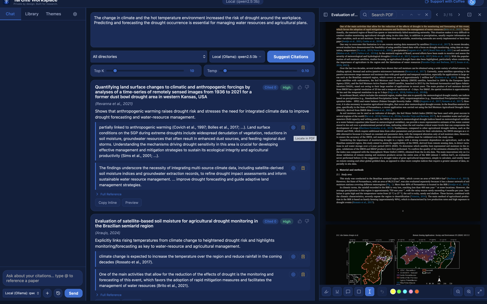
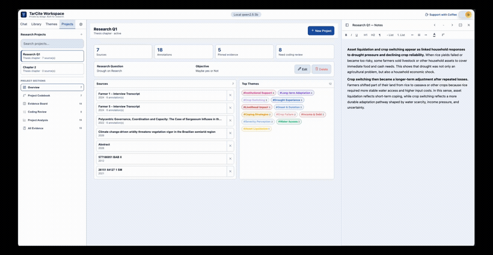
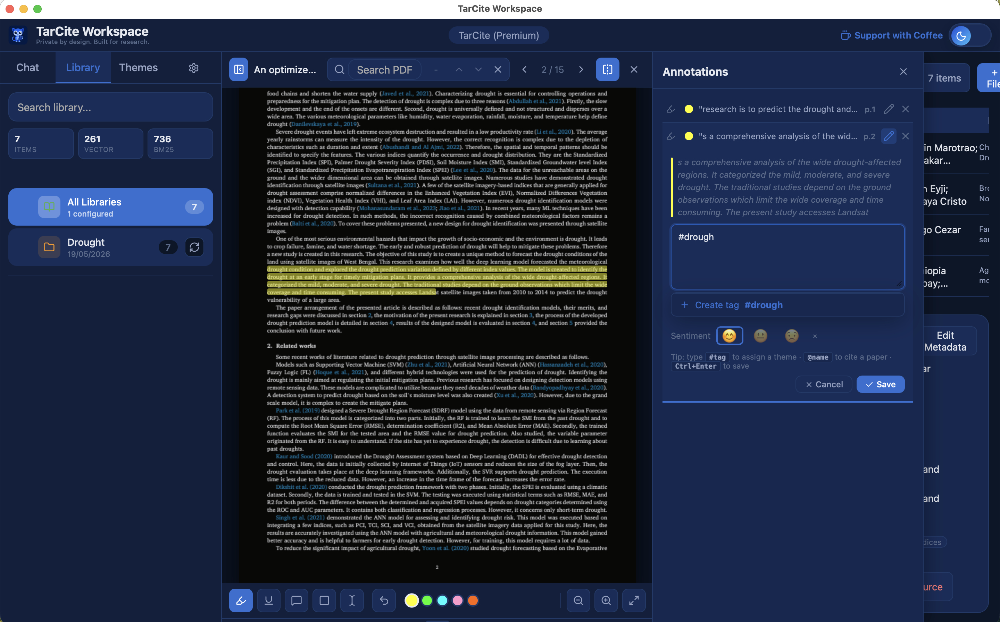
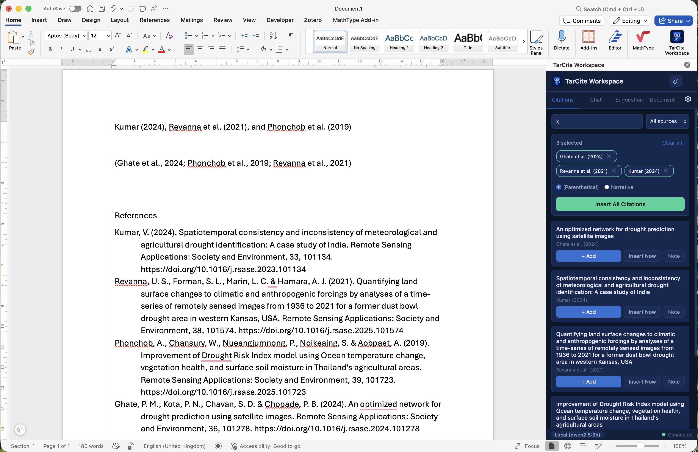

<div align="center">


# TarCite Workspace

**A local-first desktop research & citation manager with AI-assisted citation suggestions.**

Search your own PDF library by meaning, get ranked citation suggestions as you write,
annotate documents, and cite straight into Microsoft Word — all running on your own machine.

[](LICENSE)




</div>

---

## What it does

- **Semantic library search** — index your local PDFs and find passages by meaning, not
  just keywords (hybrid vector + BM25 + reranking retrieval).
- **AI citation suggestions** — paste a paragraph you're writing and get ranked, relevant
  citations from *your own* library, with the supporting passages shown.
- **PDF reading & annotation** — highlight, ink/freehand, and tag annotations; build a tag
  hierarchy across your reading.
- **Reference management** — import from Zotero / Mendeley, organize into folders, and
  format citations & bibliographies (APA 7, Harvard, IEEE, Chicago, MLA, Vancouver, …).
- **Cite into Word** — a bundled Office add-in inserts citations into your document.
- **Local-first & private** — your library, embeddings, and annotations never leave your
  machine. The AI model is pluggable: use the managed endpoint, OpenAI, or a fully local
  Ollama model.
- **MCP server** — exposes your library as tools for AI agents (see [`docs/MCP_SERVER.md`](docs/MCP_SERVER.md)).

## Demo

Organize sources into research projects, code annotations into themes, and build your
argument — all locally:

<div align="center">
  
</div>

> ▶️ [Watch the full-quality video](docs/assets/demo.mp4) · more at [tarcite.com](https://tarcite.com)

## Screenshots

**Read & annotate** — highlight, ink, and tag passages alongside your library:

<div align="center">
  
</div>

**Cite into Microsoft Word** — insert formatted citations without leaving your document:

<div align="center">
  
</div>

## Install (end users)

The **Windows installer** is published on the [Releases](../../releases) page and at
[tarcite.com](https://tarcite.com). No setup required — the app bundles everything it needs.

## Run from source (developers)

Requires **Python 3.12**. Runs from source on any OS with Python.

```bash
git clone <repo-url>
cd citation-workspace
python -m venv venv
venv\Scripts\activate            # Windows  (use: source venv/bin/activate elsewhere)
pip install -r requirements.txt
copy .env.example .env           # then edit as needed
python launcher.py
```

The app serves at `https://tarcite.workspace` (or `http://127.0.0.1:4443` in HTTP mode).
See [`docs/ARCHITECTURE.md`](docs/ARCHITECTURE.md) for how it fits together.

### Configuration

Copy `.env.example` to `.env`. Key settings:

| Variable | Purpose |
|---|---|
| `REFERENCES_DIR` | Folder containing your PDFs. |
| `AI_API_BASE_URL` / `AI_API_KEY` / `AI_MODEL` | Any OpenAI-compatible endpoint (OpenAI, the managed `api.tarcite.com`, or local Ollama). |
| `EMBEDDING_PROVIDER` / `EMBEDDING_MODEL` | Local embeddings (default) or remote. |
| `CROSSREF_MAILTO` | Optional, for polite Crossref metadata lookups. |
| `MCP_ENABLED` | Expose the library as MCP tools at `/mcp`. |

## How AI is used

The AI model is **pluggable and optional for search**. Citation suggestion sends the
paragraph you're drafting plus candidate passages from your library to an
OpenAI-compatible model. You choose the backend:

- **Managed** (`api.tarcite.com`) — key-optional, easiest to start with.
- **OpenAI** — bring your own API key.
- **Local** — point at a local [Ollama](https://ollama.com) instance for fully offline use.

Embeddings and reranking run locally by default.

## Building the installer

See [`docs/build-distribution.md`](docs/build-distribution.md). The Windows installer is
built with PyInstaller (`citation.spec`) + Inno Setup (`packaging/setup.iss`).

## Documentation

- [`docs/ARCHITECTURE.md`](docs/ARCHITECTURE.md) — system overview.
- [`docs/build-distribution.md`](docs/build-distribution.md) — packaging guide.
- [`docs/CITATION_SUGGESTION_MECHANISM.md`](docs/CITATION_SUGGESTION_MECHANISM.md) — the retrieval/ranking pipeline.
- [`docs/MCP_SERVER.md`](docs/MCP_SERVER.md) — MCP integration.

## Contributing

Contributions are welcome — see [`CONTRIBUTING.md`](CONTRIBUTING.md) and our
[`CODE_OF_CONDUCT.md`](CODE_OF_CONDUCT.md). For security issues, see [`SECURITY.md`](SECURITY.md).

## License

TarCite Workspace is licensed under the **GNU Affero General Public License v3.0**
([LICENSE](LICENSE)). This is required because it builds on
[PyMuPDF](https://pymupdf.readthedocs.io/), which is AGPL-licensed. In short: you're free
to use, study, modify, and redistribute it, and if you offer a modified version as a
network service you must share your source under the same terms.
